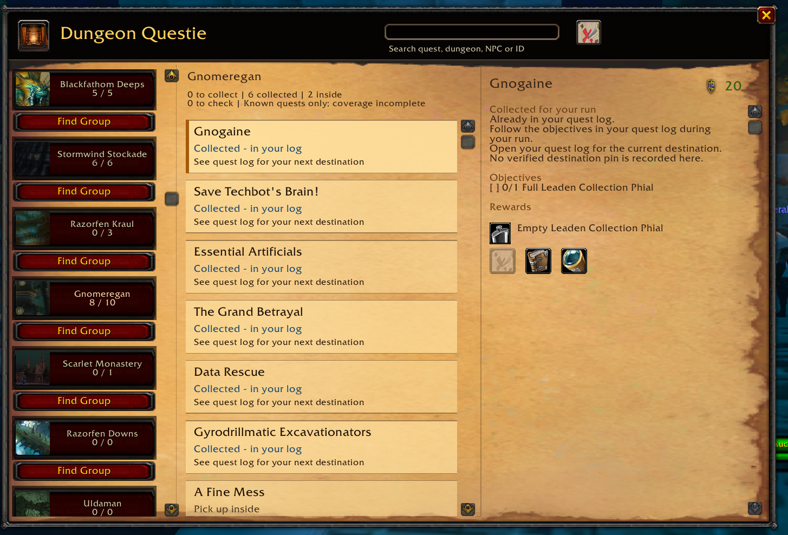
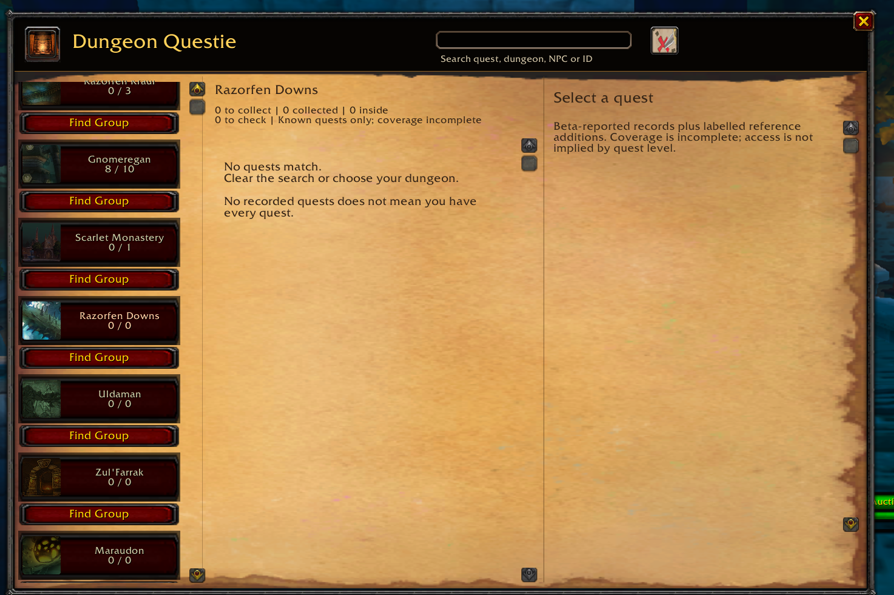

# Dungeon Questie

A dungeon quest checklist for **WoW Forever**. Pick a dungeon, find its quests,
and check what you still need before your run.

- Pickup directions, rewards and prerequisite steps.
- Progress from your quest log and confirmed turn-ins.
- Pickup pins, with optional TomTom arrows.
- Search by quest, dungeon, NPC or quest ID.
- Find Group buttons and manual whisper/invite controls.

Open with **`/dungeons`**, **`/dgf`**, or the minimap button.

**Beta:** coverage is incomplete. Classic reference entries and approximate pins
may differ in Forever. An empty dungeon list does not mean you have every quest.

## Screenshots

## Install

Download the addon ZIP from Releases and extract `DungeonGuideForever` into
`World of Warcraft/_classic_beta_/Interface/AddOns/`. Restart the game if it is
not in the AddOns list. Keep that folder name even though the addon is called
Dungeon Questie.

For WoW Forever Interface **16001**. TomTom is optional. Questie is not required.

## Credits

By Videocat. Classic reference records are adapted from
[CMaNGOS Classic-DB](https://github.com/cmangos/classic-db) under GPLv3.
Original addon code retains its MIT licence. Game content belongs to Blizzard.
See [third-party notices](THIRD-PARTY-NOTICES.md) for the complete credits and terms.
This is an independent addon, unaffiliated with the Questie project.

[Data sources and checks](SOURCE-REBUILD.md) · [Walkthrough details](WALKTHROUGHS.md)
· [Maintainer guide](AI-RESEARCH-README.md)
